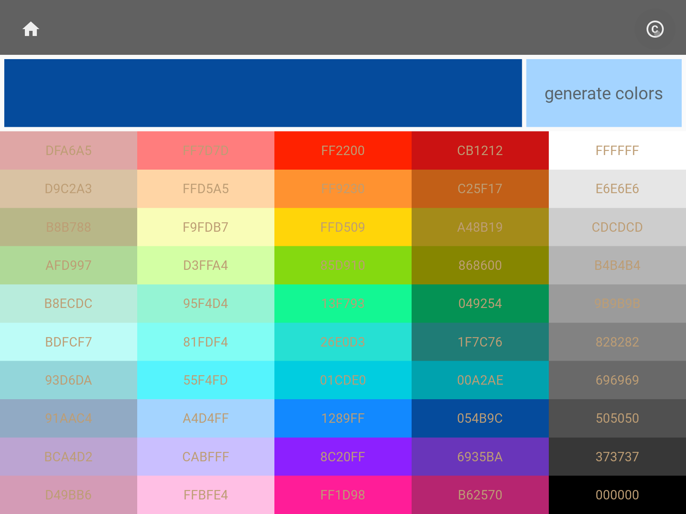
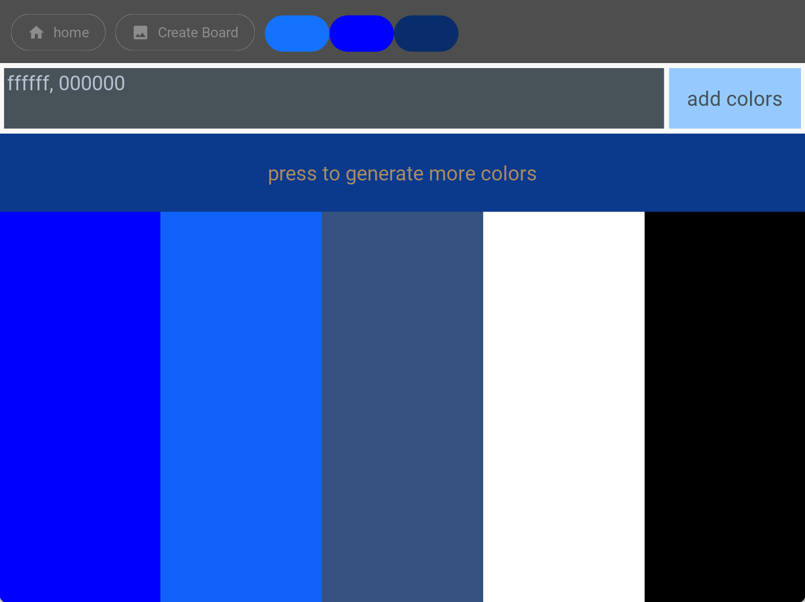
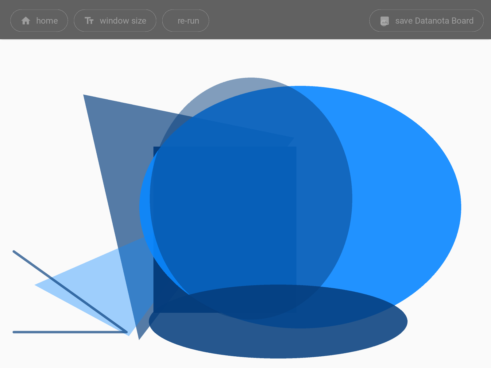

# Datanota Accent

 

Version: dnACCENT-v2.1 (as of November 1, 2024)

Features:

    - generate colors with a random walk, gradually shifting from a seed color
    - finalize color selection, with an option to add custom hex colors
    - create a mood board with random shapes, positions, and color opacity on the canvas

 

 

## How-To

### select a seed color from seasons palette

 

### click to generate random colors or add custom hex colors

 

### create and save mood-board

 

 
