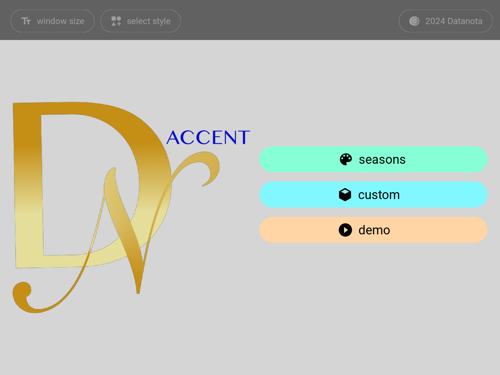
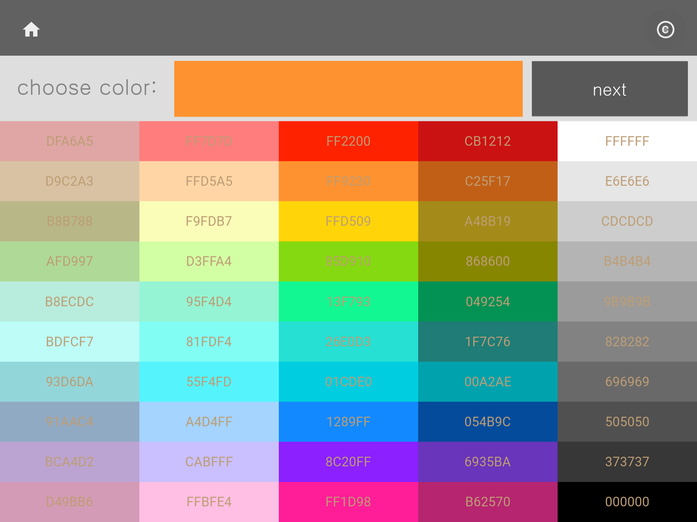
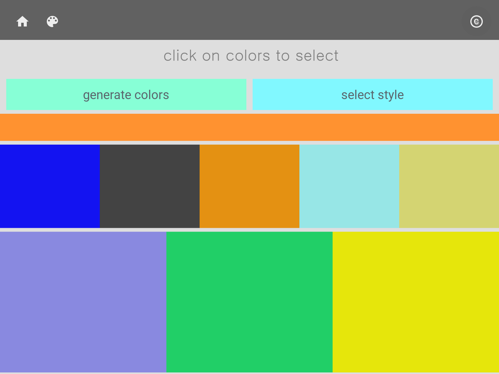
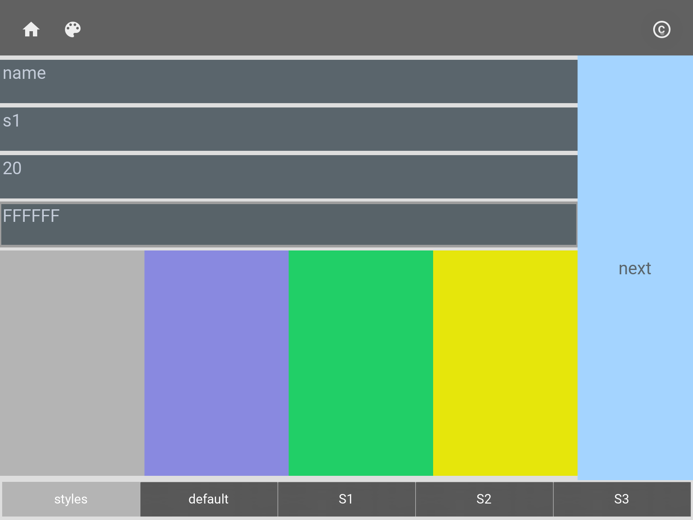
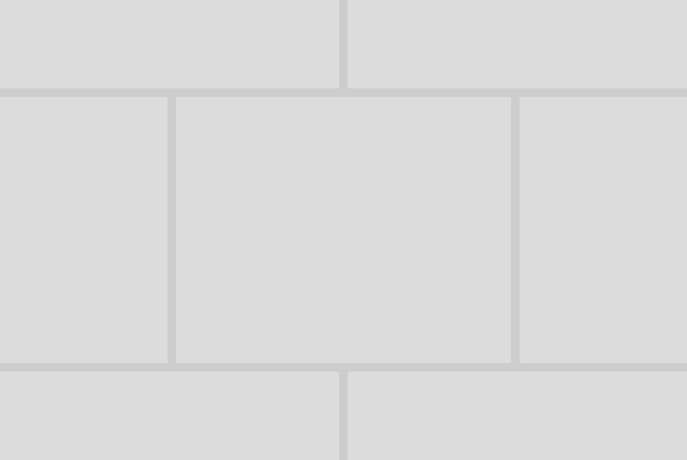

# Datanota-Accent Summary 

[visit Datanota website](https://www.datanota.com/accent)

 

 

## How-To

### select an initial color from seasons color palette

 

 

### generate random colors and finalize colors

 

 

### create mood-boards

 

 

### sample available styles

 

#### default

 

 

#### style one

 

 

#### style two

 

 

#### style three

 

