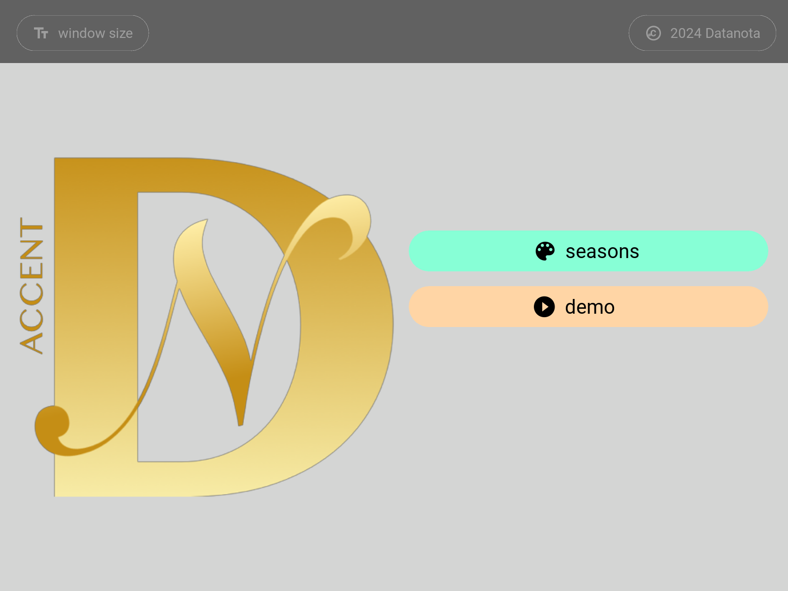
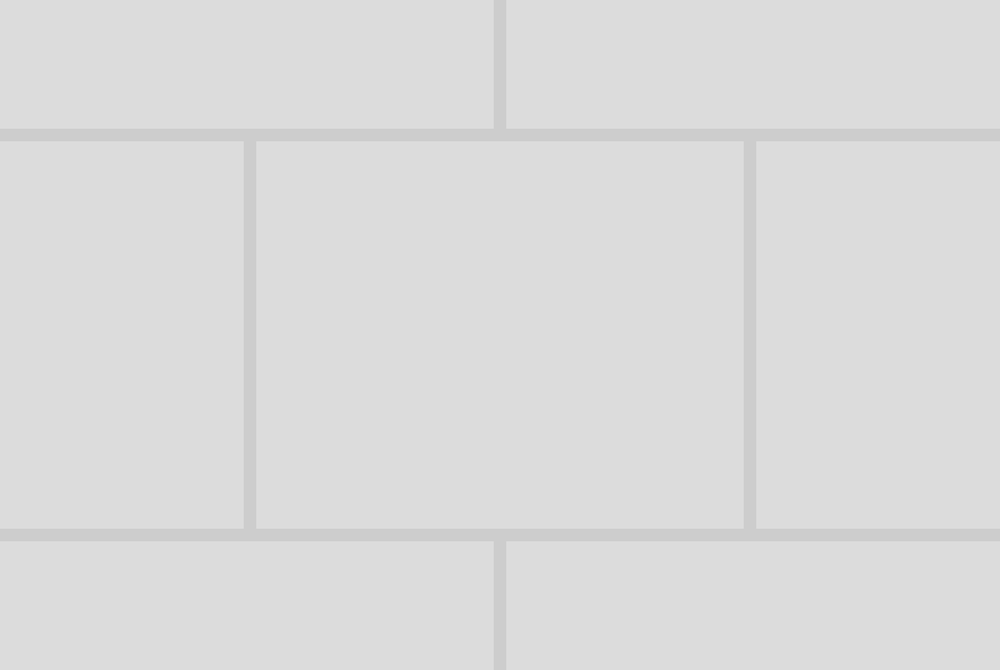

# Datanota Accent

 
Version: dnACCENT-v1.1 (as of June 30, 2024)

Initial Features:

    - random color generation
    - option to change mood-board colors by clicking on the colors
    - custom option to input your own colors in hex format
    - includes six styles: five predefined styles and one "Raw" style generated by a random algorithm
    - option to add borders to all styles except the graded style

 

 

## How-To

### select an initial color from seasons color palette or choose custom settings

 

 

### click to generate random colors (finalize choices in the settings tab at the bottom of the season screen)

 

 

### create mood-boards

 

 

### available styles

 

#### default

 

 

#### masonry

 

 

#### twin

 

 

#### graded

 

 

#### quilt

 

#### raw (random design is available by pressing the re-run button)

 

